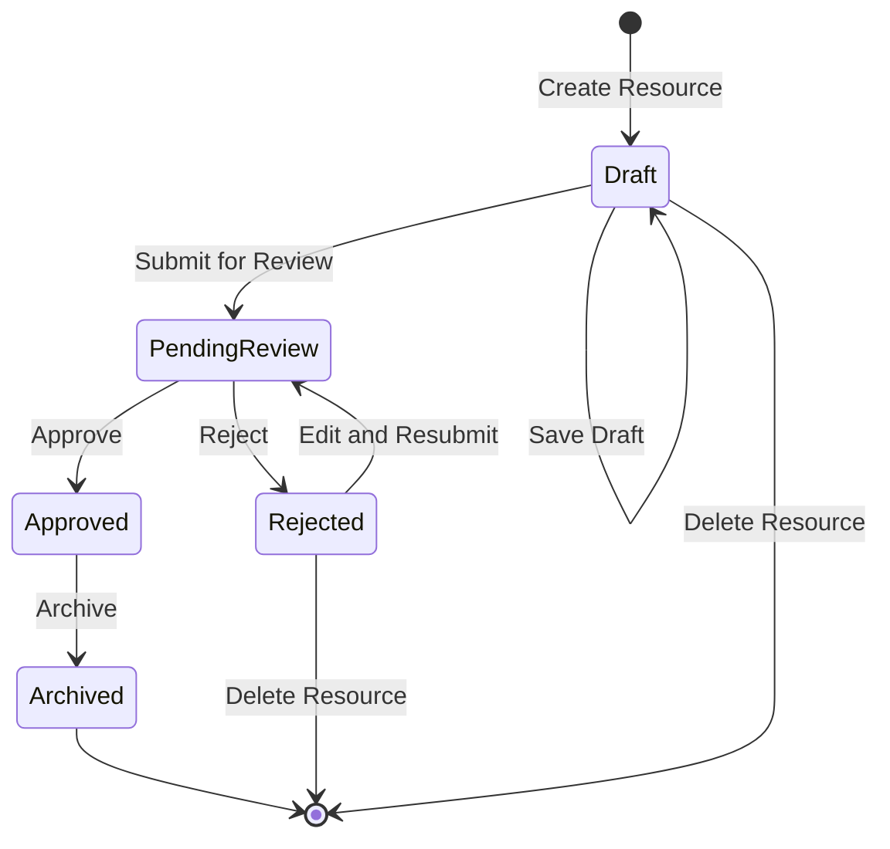

# #4 - Status Flowchart (Week 1)

## Status Flow (Contributor View)

---

## Status Descriptions

| Status | Description | Contributor Actions |
|--------|-------------|---------------------|
| **Draft** | Draft status, only visible to author | Create/Edit/Delete/Submit |
| **PendingReview** | Waiting for review, cannot edit | Wait for review result |
| **Approved** | Approved, content is public | Read-only |
| **Rejected** | Rejected, can edit and resubmit | View Feedback/Edit/Delete |
| **Archived** | Archived, hidden from public | Read-only |

---

## Status Display Guidelines

### Draft
- Show "Draft" badge
- Orange/Gray indicator
- Show "Edit" and "Submit" buttons

### PendingReview
- Show "Pending Review" badge
- Blue indicator
- Show submission time
- No edit button

### Rejected
- **Highlight review feedback section**
- Red indicator
- Show reviewer name, review time, rejection reason
- Show "Edit and Resubmit" button

### Approved
- Show "Published" badge
- Green indicator
- Show approval time
- Show "View Published" link

### Archived
- Show "Archived" badge
- Gray indicator
- Only admins can unarchive

---

## API Interface with Review Module

| Action | Triggered By | Received By | Data |
|--------|--------------|-------------|------|
| Submit for Review | Contributor | Review Module | resource_id, submit_time |
| Reject Resource | Review Module | Contributor | resource_id, feedback, reviewer_info |
| Approve Resource | Review Module | Contributor | resource_id, approve_time |

---

*Last Updated: 2026-03-30*
